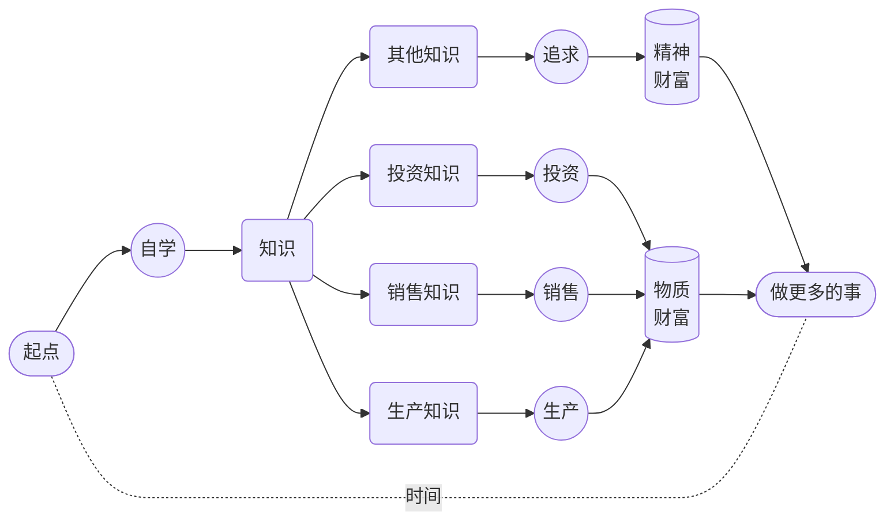
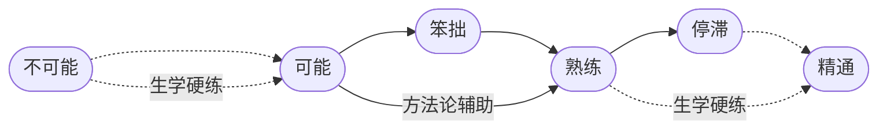
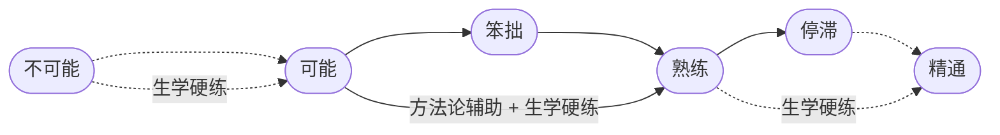

# 1. 自我训练手册

这一年的集训拉练，核心任务只有两个，**语音塑造**和**记忆扩展**。这一年的另外一个衡量指标是**每天至少三个小时** 并且要做到 **一年内至少投入一千小时的注意力**。

不要误以为最重要的收获只是**把英语变成第一语言**…… 在这个过程中，我们所积累并获得的，除了任务目标的达成之外，更重要的是（可能是很多人一生中第一次）**完整的自学经历**。

不仅如此，还有更重要的东西 —— 这个完整的自学经历，肯定会改变一个人对整个教育的看法，进而影响各种选择，进而改变一个人甚至一家人的命运。

作为作者，我无法把自己只限制在英语教学这个领域。理论上来讲，我们用同样的方式可以学天下所有的东西，只要自己觉得有必要。

某种意义上，这是我一个人与地球上整个教育体系的争斗，为了自家的孩子 —— 换个角度看，这其实是一个唐吉柯德的故事，一个疯子非要打败风车，任人评说。

## 1. 用兵打仗

人们为教育从不吝于支付金钱…… 可惜的是，人们往往不愿意为教育支付注意力 —— 英文的习惯用法很准确，**注意什么东西**是 *pay attention to something*。

我们手里通常有三种资源，**金钱**，**时间**，**注意力**。教育的本质是**投资**自我。天下的投资都一样，投资就需要时间作为基本生产资料，不花时间的或者只花很少时间的不是**投资**，我们对这样的行为有另外一个称呼，叫作**投机**。

投资的时候，我们做的事情，本质上来看都一样，其实是在**往时间里倾注金钱**。如果采用定投策略的话，那就是**不断往时间里倾注金钱但绝不倾注注意力**。当我们学习的时候，或者说，当我们投资自我的时候，有个重点区别，我们要往**时间**里倾注的也有**金钱**，但与此同时，更重要的是**注意力**。

从这个角度望过去，一切学习失败的根源，无非以下两种：

> * 花钱不花时间
> * 花时间不花注意力

到最后，所有的失败都一样，只不过都是因为**没有往时间里倾注足够的注意力**而已。

人们总是误以为决定学习成败的关键在于智商，并且还总是误以为智商这个东西是一成不变的。可实际上，这两个观点都是基于误解的幻觉。

真正的决定性因素在于**注意力**。

我有一个较为形象的说法。如果一个人可以做到持续 25 分钟左右注意力集中，那么，他就相当于是位**将军**，**有兵可用**。一次持续 25 分钟的注意力集中相当于一个兵。如果一个人在一整天的时间里能做到若干次持续 25 分钟的注意力集中，那就相当于**这位将军有若干个兵可用**。

兵越多当然就越好。只不过一天里的时间是有限的，与此同时，为了注意力集中大脑也的必需消耗大量的能量，所以，兵不可能无限多。然而，对绝大多数普通人来说，只要一天能带上七八个兵，就能做很多事情，若是能够持续下去，就一定能够达成相当惊人的成绩。

**有兵可用**之后要**有仗可打**。养兵靠打仗。没仗可打，兵就会慢慢废掉。只要兵在不断地打仗，它就会变得更为强大，具体表现就是，从**可以持续 25 分钟注意力集中**，发展成**可以持续 30 分钟 40 分钟甚至更长时间注意力集中**。兵当然越强越好。只要是强兵，用很少的兵也可以打很大的仗。

用强**兵**打什么**仗**呢？学习就是用兵打仗，自学就是自己用兵打仗…… 我们这一辈子的绝大部分时间都应该用来**自学**。学什么？学生产知识、学销售知识、学投资知识 —— 用来创造物质财富，然后还要学很多其他知识 —— 用来追求精神财富，然后才能用时间做更多的事情。

遗憾的是，大多数人压根就**无兵可用**，他们根本做不到持续 25 分钟注意力集中。所以他们也不大可能是这个类比中的将军。他们也**无仗可打**，所以他们也根本养不出兵…… 这跟智商或者天分没有任何关系，手里没兵，再聪明都没用。手里有点兵但无仗可打，还是没用，并且因为无仗可打，所以哪怕就那一点兵早晚还是会废掉…… 还是一样的，再聪明也没用。

猜一猜最令人遗憾的事情是什么？

> **每个人原本都有兵，并且还都是强兵。**

小朋友的注意力持续时间都很长，只要不被打扰，他们很容易被某个事物或者活动吸引，然后就会一直专注下去，除非饿了。

父母们往往并不知道要呵护自家孩子的注意力 —— 不管孩子在干嘛，他们都可能随时冲上去抱一下，亲一下，只顾着满足自己。学校也很可能是破坏大多数孩子注意力的帮凶，虽然肯定不是出于故意 —— 长期被迫坐在枯燥的课堂里一口气几十分钟，很多孩子并没有学会注意力集中，真正练出来的是如何坐在那里走神但不被发现。商品经济已经演化成注意力经济，全世界都在争夺我们的注意力。最近十几年兴起的移动智能设备，把地球上绝大多数人的注意广度（Attention Span）生生压缩到了两分钟之内……

就这样，大多数人逐步变成了彻底**无兵可用**、压根**无仗可打**的人 —— 可无比遗憾的是，他们每一个人都一样，在最初的时候，都是天生就带着强兵的强将。

表现出来被别人看得到的聪明，其实都是积累出来的 —— 别说聪明了，连所谓的天分都是如此，如果天分这个东西真的存在的话。

过去，人们认为**标准音高**（Perfect Pitch）是一种天分，有就是有，没有就是没有，人群中恨不得只有十万分之一的人拥有这种天分，比如莫扎特 —— 莫扎特可以分辨任何声音的音高（Pitch），哪怕是你在另外一个房间咳嗽一下，他都可以用键盘弹出你刚刚那声咳嗽的音高。

可后来研究者们发现，人们过往误以为的天分，其实都是 “练” 出来的，无一例外 —— **练出来**的诀窍竟然只不过是**练的久**…… 对那些被称为天才的人，他们真正的**优势**其实只不过是**练得早**，所以才**相对练得久**…… 越来越多的脑科学家们的研究结果在不断支持这个结论，每个人天生可能都有差不多的**潜力**，只不过这个潜力要**练**才能**实现**…… 换句话讲，很多人不是没有天分，而是因为虚度了时光才吃过了失去了实现天分的机会。

练习标准音高没多难，没多复杂，网上甚至有很多免费的开源程序。今天，人群当中拥有标准音高的比例，早已不再是十万分之一，也不是万分之一、或者千分之一…… 早就超过了百分之一，并且，这个比例还在不断提高。无数实例表明，任何人都可以习得标准音高，只要练习的密度足够大时间足够久，从任何年龄开始都可以 —— 为什么？这不压根是什么**有就有没有就没有**的东西，它只不过是**练就有不练就没有的东西**…… 

人和人之间毕竟有所差异，所以，人们常说的**天分**还有另外一层意思指的是这种**不可避免的天生差异**。比如，手指短的人可能弹琴相对吃亏一点，个子矮的人可能打篮球相对吃亏一点，长得帅的人在人际沟通中相对可能更有优势，有标准音高的人在学外语尤其是练语音的时候肯定相对更有优势…… 这好像是不可否认的事实。但与此同时，我们总是可以看到更多的**反例**，手指短的钢琴大师其实不少，个子矮的篮球明星并不罕见，长得丑但成功率更高的谈判专家非常普遍……

学就是了，练就是了。反正，你应该是一位将军，你原本的确是一位将军，你要带兵打仗。

一场又一场的胜仗打下来，积累的不仅是成绩，还有越来越强越来越多的兵，以及调用指挥这些强兵的经验。如此看来，到最后，一个人能拥有的最强能力，就是**调用并指挥注意力的能力**。一旦真的拥有了这个能力，有兵可调，有仗可打，那就只能所向披靡，无往不利 —— 这跟智商和天分显然全无关系…… 如果真的有关系的话，应该是人们常常把这种能力的展现理解为智商或者天分吧。

还是**换个观念吧！**

> 天分这个东西就算真的存在，和所谓的智商一样，都是**练出来**的，都是**攒出来**的，而不是像某个配件一样可以直接安装或者干脆预装的。

在这方面换个更合理的观念非常划算的，因为那等于轻松且又瞬间地直接换了个脑子 —— 比所谓的脱胎换骨实在多了。

以下分步的陈述可能更准确更有效：

> - 你有无穷的**潜力**；
> - 你的**潜力**能否**实现**，取决于你**练不练**，**练多久**，**练多早**，**练多狠；
> - 你能实现**多少潜力**，取决于你有**多少时间**；
> - **你的时间**是否有效，取决于你向其倾注了**多少注意力**。

学习的理由无数。但从这个角度望过去，倒也非常简单直接清楚：我们必须**拥强兵为强将**，否则多可怕啊！用我们的时间，调兵打仗。无仗可打的话就找仗去打。生命不息，战斗不止，能实现多少潜力就实现多少潜力。

## 2. 只能自学

**学习**这个词，由**学**和**习**两个字构成。前面是**学**，**求学**的**学**；后面是**习**，**练习**的**习**。在中文里它们原本是各自独立的两个词。孔子曰，**学而时习之，不亦乐乎？**后来的中文里，人们干脆把**学习**两个字组合起来构成一个词，意思就是说，**求学**只是一部分，而另外还有一部分是**练习**。

花钱买书，花钱上学，到此为止，只是**知识获取**。家长也好、老师也好、学校也罢，甚至整个社会一直在误解**学习**，家长们不吝于投入大把的金钱把自家孩子送进学校，把整个教育外包给学校里的老师…… 学校里的老师们主要在干嘛？把书本里的知识讲一遍。再负责一点就反复讲，做到 “的确将所谓的知识告知了学生”。

然而，这只不过是教育这个万里长征的第一步而已。后面的**练习**呢？为了在自己大脑里新建连接新建网络而必须进行的**短时间内足量重复**呢？学校也好，老师也罢，完全无能为力 —— 并且，理直气壮地认为那是学生自己的事，跟自己没关系…… 这本身倒也没错，的确是学生自己的事。

可问题在于，父母花钱买的商品及服务，就只是或者只能是发教材讲解教材吗？小学三年级之前也许还有必要，等常用字词已经搞定了，自己也会查词典了，电脑上有搜索引擎甚至人工智能，真的有必要非得花那么多钱找人讲给自己听吗？

教育越来越昂贵，可是，过往的两三百年里，全世界都一样，收着最贵且越来越贵的价格，交付的是一直是最不重要的那个服务，发书讲书而已…… 实在觉得对不住，就使劲留作业，这就算对的起那么昂贵的费用了，是不是有点说不过去？

很多家长没有反应过来。人类进入 21 世纪之后，必要的教育所需要的任何知识，早就已经接近于免费了。网络上没有找不到的基础知识及其讲解。[Wikipedia](https://www.wikipedia.org/) 和 [Youtube](https://www.youtube.com/) 已经是天下再好的学校了。再高级一点的知识，再系统一点的讲解，只要识字就可以去买书。到 2020 年，[Amazon](https://www.amazon.com/) 上在售图书已经超过 5 亿册，没有你找不到的东西，平均每本书 25 美元，与那么昂贵的学费相比，这仍然是几近于零的免费！

绝大多数人的问题都一样，都肯花钱，也有一些肯花时间，却全都不肯花注意力 —— 说实话，他们也不知道注意力应该花到哪里，姑且不论有没有足够的注意力。

学习，**学**与**习**，**求学**与**练习**相比，显然**练习**更为重要。**知道**与**做到**之间存在着非常遥远的距离 —— 时间上的距离。

学外语就是很好的例子。我可以清楚详细且又系统地把各个英文音素的发音方式和要点写给你、讲给你，还可以反复讲…… 然后你的确可以表示自己知道了，但你真的能做到吗？马上能做好吗？不是不一定，而是刚开始一定不能。

学了不练就没有用。练习必然耗费大量的时间。

并且，练就只能自己练。学的时候也许大伙一起更有效果，但练的时候大伙一起往往都会被最差的那一个拖后腿。并且，每个人都不一样，每个人的难点不同，每个人之前的积累不同，每个人练习的方式不同…… 所以，绝大多数情况下，有用的**练习只能是个性化的**，越是关键点越是如此。

所以说，**练习不仅只能靠自己，绝大多数情况下还是非常私人的**。我可以告诉你一个秘密：只要肯练，不管有没有天分，任何人都可以学会弹奏乐器，都至少能达到一定的程度。练过琴的人都知道，练琴跟练任何东西一样，只能私下练。刚开始那么笨拙，弹出来那么难听，自己不好意思让别人听到，别人听到了也的确不开心。没有初学者愿意在舞台上当中练习，不是吗？

练习必须私下练还有另外一个理由，与我们的大脑机制有关。学习的时候，大脑最怕的被他人关注，被越多的人关注越可怕。**因为大脑最怕死，尤其怕社死。**一旦意识到自己被关注，大脑就要把注意力分散出去，而后很可能马上就宕机。这叫聚光灯效应（Spotlight effect）。如果你突然意识到所有人都在看着你走路的话，突然之间，你有可能干脆不会走路了……

自己花时间练习也许并不够，因为很多人练习的时候注意力并不集中。一不小心就变成了在走神的状态下肢体在进行下意识的机械重复。

科学家们提出了一个极为重要的概念：**刻意练习**。按照他们一致的说法，刻意练习的关键在于**不断提高练习的难度**，**不断突破舒适区**，否则，更多的练习不仅不会带来进步，还会导致一定的退步。

**练习**当然要**努力**，即，**短时间内足量重复**。那么刻意练习呢？关键在于哪里？我觉得：

> **刻意练习**的关键在于**注意力**：
>
> > 在**练习**的过程中要有组织有计划有系统地调用并集中自己的**注意力**，发现问题，解决问题……

换言之，注意力不集中的练习往往会沦为无效练习，只浪费了时间，却没有任何收获。

刚才我们说，**知道**与**做到**之间存在着非常遥远的距离 —— 时间上的距离。现在，我们还得继续补充。这个时间必须注满了**注意力**才有效，空洞的时间总是无效…… 请问，这个时间里应该是谁的注意力？只能是**自己的注意力**。谁往时间里倾注注意力，那本事就长在谁身上。

练习就是这样，在自己的空间里往自己的时间里倾注自己的注意力，也许偶尔需要他人帮助，但，总体上，练习就是与他人无关，只能是自己认真做的事情。

自学，并不意味着说一定要完全孤立自己，虽然集中的注意力只能出自自己，虽然有效的练习常常只能是私人甚至私密的…… 自学的关键在于**主动**。**主动向他人求教**就很关键。**主动锤炼自己的教师品味**也很重要，比如，你最好在能分辨出谁是真正的好老师的同时，也能分辨出谁是跳大神的二货…… 这就需要自己主动建立一系列的**评判标准**。然而，不自学的人，无论如何都不可能有任何真正恰当且有有效的标准。

人天生是社交动物。大脑内部是无垠的网络，大脑外部也是无垠的网络。人们在相互交流相互观察之中潜移默化地学习。社交过程中形成的各种微调，永远是教科书、老师和学校无法替代也无法达成的东西。想想那个例子：你的口音就是会因为生活地点的变化而不知不觉发声变化，没有什么教科书、老师或者学校可能导致这种不知不觉发生的微调。

所以，**主动寻找更好的环境**也很重要。正如在大家都挥霍的时代里你也会不由自主地更加挥霍一样，若是大家都在玩乐沉沦你会不由自主地浪费更多时间。同样的道理，如果你身处在大家都对学习感兴趣的环境里，那么，你自然而然就会对学习更感兴趣；在大家都努力工作的环境里，你自然会比原来更加努力。万一你身边积极向上的人更多且很多，你也自然会找到更多的理由奋发图强。

**主动帮助他人**最重要。帮助他人可能是天下成本最低却又收益最高的社交手段。关键在于，帮助他人发现问题解决问题，是锻炼自己的机会，因此建设得更好的是自己的大脑皮层。学习的核心之一就是发现问题解决问题，可是，仅靠自己一个人很难有机会遇到所有问题，不是吗？于是，帮助他人虽然可以收获感激，但更重要的另外一个副作用是获得了原本可能并不存在的锻炼自己大脑的机会。

学校原本应该起好作用，但最终总是在大多数人身上普遍留下了这样那样令人无比遗憾的印记。学校里枯燥的课堂、无聊且无尽的作业、没完没了大大小小的考试，虽然都出于好意，最终磨灭的是学生的**主动**。十几年如一日，学生们一直在**被动**地疲于奔命…… 到最后甚至在他们的眼里，父母竟然沦为了学校的帮凶。终于，他们最后唯一的主动诉求只剩下逃离的渴望。斗转星移之间，他们中的绝大多数不知不觉地彻底失去了**主动能力**。

**自学全靠主动**。目标要自己找，动力要自己挖，计划要自己做，困难要自己克服，错误要自己纠正，注意力要自己集中自己的注意力，好坏最终只能靠自己验收，后果只能自己承担…… 若是竟然失去了主动能力，这一切就无从谈起。

社会上绝大多数人根本就没有自学能力。可说实话，这事儿很难全怪他们，他们原本不是那个样子，上学前都好好的，主动的能力非常完整。那责怪学校有没有用呢？首先没用，其次更重要的是看透真相。因为这世界原本就是这个样子，从来都是这个样子，古今中外都一样：**好的意图从来都并一定不保证好的结果**…… 并且，**重要的事情从来都只能靠自己**，越是重要的事情越是如此。

## 3. 生学硬练

无论我们做什么事情，大脑都要协调很多的器官才能够完成，它不仅要协调大脑外的各种器官，它还要协调自身内部的多个部位。无论是大脑外部的种种器官还是内部的各个部位，对大脑来说，都是大脑自身内部无数个**局域网**的联动……

这些局域网都是逐步建立起来的 —— 每一个都是通过学习建立，通过大量重复使用强化。无论我们想要学什么，第一步总是注意力集中地观察 —— 调用任何必要的感官，视觉、听觉或触觉等等  —— 然后我们才开始尝试……

几乎总是一模一样的流程：一旦开始**尝试**，首先遇到的肯定是**不可能**，要经过**反复尝试**之后才会遇到**可能**，可能之后马上遇到的是**笨拙**，再过一段时间才可能是**熟练**，而后可能是漫长的**停滞**，要经过很多刻意练习之后才可能**精通**……

这之中最重要且又最难的，当然是从**不可能**到**可能**的跨越，那可是 0 到 1 的突破。

核心的难度首先在于，**我们的观察永远不大可能完整**。举个例子，我的母语之一是朝鲜语，所以我能发出齿龈颤音（[Voiced alveolar trill](https://en.wikipedia.org/wiki/Voiced_dental,_alveolar_and_postalveolar_trills)）。我家有个小朋友小名叫都都（dū dū），平日里我逗他玩的上班，会故意用齿龈颤音喊他名字：

<audio controls><source src="../audios/dudu.mp3">Your browser does not support the audio element.</source></audio>

他们觉得很有趣，也想发出同样的声音。可在接下来的很长一段时间里，他们就是发不出这个音。他们会反复尝试，但就是做不到。他们发出的可能是用嘴唇发出来的颤音 —— 只不过，在那一瞬间他们自己也知道那不是他们听到的那种颤音。他们会继续想办法，换各种各样的方式尝试，但依然不行……

主要原因在于，他们看不到我的舌尖是如何在齿龈部位颤动的 —— 这就是观察无法完整造成的难度。另外，我还真讲不清楚我到底是怎么做到的，我会误以为我从小就会…… 实际上并非如此，当初的我和我现在的孩子一样，刚开始怎么也发不出这个声音，很久之后才能发出那种声音，但，我早就忘了自己其实是通过无数次尝试才习得的，竟然误以为那是一种天生的能力。

幸亏，在 Wikipedia 上，有这种齿龈颤音的完整且又系统的讲解 —— 有 37 种语言的翻译，其中，英文版是 [Voiced alveolar trill](https://en.wikipedia.org/wiki/Voiced_dental,_alveolar_and_postalveolar_trills)，中文版是[齿龈颤音](https://zh.wikipedia.org/?curid=274842)…… 不仅有详尽的文字讲解，还有慢动作视频演示：

<video controls width="480"> <source src="../videos/voiced-alveolar-trill.mp4" type="video/mp4"></source>Your browser does not support the video tag. </video>

现在，不仅观察完整，方法论也很系统…… 可是，看过之后就能做到吗？显然还是不可能。大脑内暂时还没有对应的可供调用的基础功能性局域网，需要新建。并且需要的还不止一两个，别看只是这么小小的一个动作，实际上却需要远比想象多得多的基础功能性局域网相互协调。新建连接新建网络就是需要时间，无论观察完不完整、方法论存不存在，时间总是不可跨越。

那如何才能**突破**呢？

在我长大的年代里，香港连续剧在中国大火，又由于那个时候可看的东西少，往往是一部剧全国都在追…… 在某部武侠剧里，一个 “武林高手” 在镜头面前有个特写，观众们看到的是，他的耳朵竟然会动！第二天，全班同学都互相问，你的耳朵能动吗？大家都不行…… 在此之前，每个人的耳朵都没动过，也没想到过要动。过了几天，有个同学说他 “会动耳朵” 了！大家惊讶地看他表演…… 再过几天，班上很多同学都 “学” 会了怎么 “动” 耳朵…… 当然，谁都说不明白 “如何动耳朵” 的 “方法论”，都是一样的措辞，“多试试就可以了”。

就是这样 —— **多试试就可以了**。

在新疆，所有人在很小的时候就 “学” 会了 “晃脖子”，那是一种其他民族的人少有能做出的动作。你去问他们，到底应该怎么晃脖子，他们真说不清楚，就算偶尔有人说得很清楚，你也学不会…… 真的 “学不会” 吗？肯定能学会，至于 “方法论” 么，不是没必要，而是它能起的作用并没有想象得那么大。

很少有人能 “动鼻尖”，生活中，也没有什么这样的 “需求”…… 但，两个版本的《家有仙妻》的主演，无论是电视剧版里的伊丽莎白·蒙哥马利还是电影里的妮可·基德曼都学会了这个动作 —— 怎么学会的？跟 “动耳朵”、“晃脖子”一样，“多试试” 就可以了。

突破的关键在于**不停地尝试**，一个方式不行就再换另外一个方式。反正新建连接新建网络就是需要时间，用什么填满那些时间呢？试错 —— 这可是大自然用来进化的唯一有效策略。进而，为什么可以不断尝试？又，为什么愿意不断失败不断尝试？因为它**肯定可能** —— 别人能做到，我也能做到…… 

这才是人生最凶悍的学习方式，我称其为**生学硬练** —— 不断试错直至可能，不断重复直至熟练：

> 因为肯定可能，所以才愿意不断尝试；失败很正常，换个方式接着尝试，直到可能。

一切的学习，对大脑来说都一样，最初 0 到 1 的突破，根本就没办法靠方法论解决，都只能靠生学硬练闯过去…… 等这一关过了，在把不可能变为可能之后，从笨拙走向熟练的过程中，方法论才开始有机会发挥作用。

可问题在于，方法论这个东西，即便有用，也常常并不能独立起作用。举个例子，我告诉你 `ŋ` 这个音后面跟着元音的时候会变成 `n`（[2.2.3.](../sounds-of-english/15-mn)）—— 你当然瞬间能够理解，甚至能够记住，可是，下一次你开口说的时候，就能做到吗？十有八九做不到。这种例子比比皆是，绝大多数英语语法知识点对第二语言习得者来说都是这样的，考场上基本上都能把题做对，可是一开口说，一动手写，就接二连三出错，即便在出错过后瞬间还能够自我意识到…… 

很多重要的知识和技能就是这样，知道根本没有用，哪怕熟练也不够用，必须精通才真正有用 —— 因为必须做到能够下意识无意识都能做对的地步。大里必须为了这个所谓 “知道” 要建立新的连接和网络，并且还要不断强化，强化到一定地步才能够下意识甚至无意识地正确处理这种情况 —— 熟练只是卸载了部分负担，这需要极大量的重复，最好还是短期内足量重复；必须精通才能彻底卸载负担，这还需要极大量的重复，最好还是短期内足量重复…… 只有精通，大脑才能彻底无负担地同时做其他的事情……  说来说去，这不全都只能靠生学硬练嘛？

所以，生学硬练实际上贯穿着整个学习过程 —— 从始至终，任何时候都可能需要生学硬练，关键的时候尤其如此。之前的说法也应该调整一下了，所谓的生学硬练，应该是**不断试错直至可能，不断重复直至精通** —— 而不只是熟练而已。

**生学硬练，原本是我们与生俱来的能力。**毫无疑问，在最初的几年里，无论什么都是我们通过生学硬练掌握的。理论上来讲，自然语言处理，是人类的大脑终生能够处理的最高级最复杂的任务（没有之一）；与之相应的，自然语言习得，显然是我们这一生能够遇到的最复杂最艰难但又必须完成的学习任务。但是，自然语言习得的最基础部分，**语音塑造**和**记忆扩展**，却能在还没上学还不识字的过程中就逐步完成 —— 全靠生学硬练。

即便是到了很多所谓高级的领域，也还是一样的。有人能手把手教，当然很好。但总有一些是身边没有人会的，那怎么办？看书，然后自己学、自己练。有没有可能连书都找不到呢？当然。没有人可以在身边手把手教，书里也找不到，那怎么办？到最后永远都能仰仗的，再一次只能是生学硬练……  

随着时间的推移，绝大多数人竟然彻底忘记了自己曾经拥有过的生学硬练的本领。这背后的根源虽然有点微妙但也格外简单。

每个人的时间都有限，刚开始的时候并不觉得，所以很难在意**效率**。随着岁数的增加，过去的占比越来越高，未来的占比越来越少，效率的重要性就显得越来越大，于是，越来越渴求一切可能会提高效率的方法论…… 越来越痴迷于方法论，甚至不惜欺骗自己去相信那些只是胡搞瞎搞但就是敢坚称自己有效的所谓方法论。甚至，开始莫名其妙地鄙视生学硬练。与此同时，一切需要生学硬练的，都直接跳过，借口说那需要一些自己没有的天赋，所以自己永远学不会 —— 倒是可以因此轻松原谅自己，以效率为名。

绝大多数人的问题只不过是，对自己要求太低，对世界要求太高。特别擅长糊弄自己，然后也习惯了糊弄世界…… 这个世界说实话倒也听宽容，一般不会马上反击，可它总有忍不住的时候，万一它反手一个耳光扇过来，没有人能承受得住。

生学硬练也有技巧：**变着花样不断搞**。**试错**，总是需要不断地换新方式去尝试，然而，**重复**，也需要不断地换着方式重复，从各个角度、从各个层面去重复，变着花样去重复。只要你肯不断变花样，原本看起来无比枯燥的生学硬练就会变得趣味丛生，其乐无穷。

## 4. 自我纠正

**自学**的核心之一是**自我纠正能力**。

做得好的人都一模一样，做得差的人千奇百怪 —— 因为每个人的错误都非常个性化。自我纠错难就难在这里，个性化错误的主要特征就是细小且又繁杂，并且常常连自己都觉得出其不意乘其不备。

自我纠错就好像给自己剃光头一样，看起来不是什么难事，结果总是莫名其妙地残留着几根要过段时间才能被发现…… 不要误以为别人帮你剃光头就完美了，没用的，你自己去过几次理发店就知道了，到最后总是可能会有幸存的那么几根。

全面纠错只能靠自己，别无他选。反过来也一样。但凡一个人拥有足够强的**自我纠正能力**，那么他就是自己最好的老师、教练、同学、朋友。可问题在于，**自我纠正能力**如何培养，它又从何而来呢？

先说一个与我们自身大脑有关的现象：

> * 你注意不到的事情，对你来说就不存在；
> * 你并不知道的事情，你就无法注意得到……

很多人不是不花时间，也不是不努力，但，最终沦为无用功，问题出在哪里？

关键在于后一点。很多人的所谓练习之所以最终无效无用，是因为练习的过程中没有把注意力集中在要点上。在整个练习的过程中，因为不知道自己需要注意的要点都是什么，所以，无法注意到在那些要点上出现的错误和偏差 —— **不知道就注意不到**。

知道不一定能做到也不一定能做好，但不知道肯定做不到做不好。

每个人都一样，记忆力没有自己想象得那么好。不是什么东西看一遍就记得住的。基础知识也好方法论也罢，都写在教材里 —— 知识获取本身现在既方便又便宜。可问题在于，谁都一样，都做不到只看一遍就能全都记住，不是吗？

全都记住了还不一定能做好呢…… 但，这恰恰是很多人没反应过来的关键：

> 就算暂时做不到，就算暂时做不好，**要点一定要尽早烂熟于心**。

不只是一般的记住，而是烂熟于心，翻过来掉过去，每个细节都能随时调用，每个细节之间的关联都清楚，每个细节都能讲明白…… 就好像那些经验丰富的老师一样 —— 对，自学就是自己教自己，在自己这个学生还做不好甚至做不到的时候，自己这个老师要先认真备课，否则自己拿什么教自己啊？不提前认真备课，自己拿什么监督自己调整自己呢？

烂熟于心的方法再朴素不过了，反复阅读教材，不是两三遍，不是十几遍…… 而是更多遍，反复阅读，反复整理，直至每个细节、每个关联都能够随时讲述清楚 —— 和你佩服的老师一样。说实话，那些敬业的老师也是这么做的，没有什么别的方法更可行更有效。

我们想要塑造我们的语音，也是同样的方式。你要花一整年时间才能搞定呢，但，在第一个月里，语音教材要只字不差地阅读，并且还要反复阅读。你会越读越快的，不出一周的时间，你会发现完整过一遍只需要一点点的时间，一天能过很多遍。继续。不仅每天过很多遍，还要尝试着自己给自己讲课，看看能不能系统完整地讲清楚 —— 验收系统性和完整性。也可以尝试给别人讲，比如，给自家的孩子讲；还可以尝试带着他们做一样的事情，让他们给你讲，你来提问，你来验收系统性和完整性。

把所有要点烂熟于心，并不能保证你自动做到或者自动做好，因为你的大脑只是牢牢记住了那些要点，至于做到或者做好，那就要通过短时间内足量重复的练习在自己的大脑内部新建连接新建网络、强化连接强化网络…… 必要时还要借助生学硬练呢。

不一样的地方在于，**一旦你知道了你就注意得到**。对于那些要点你越是烂熟于心，你越是能够轻松地注意到在关键点上你做不到的地方，你做不好的地方 —— 这时候，那些方法论才开始真正发挥作用，你可以调用你的注意力系统且又完整地进行突破，要么暴力破解要么逐步微调。

可是，如果你不知道的话，你的注意力就压根没有目标可以集中，它就会跑到鬼知道的什么地方，进而你的所有练习都可能毫无作用，因为你的时间里并没有被你的注意力填满 —— **只有用注意力填满的时间才具有真正的价值**。

绝大多数人对自我纠正能力培养的过程充满了误解。

实际情况是，绝大多数人从未自己把教材阅读很多遍，他们顶多听老师讲一遍，可说实话，大多并没有听全。或者，另外一些的确认真听讲了，却又到此为止了，觉得自己已经足够尽力…… 说实话，他们的自我感觉也的确有点根据，毕竟他们已经比绝大多数人强多了。极少数人可能读了很多遍，甚至自己也做了很多归纳总结，但，不知道从知道到做到依然还需要很多**生学硬练**，所以也没有走到尽头，虽然已经成绩不错。

最大的误解在于，如果不认真提醒的话，绝大多数人会误以为自己**做不到**将教材烂熟于心。其实，人类的记忆力都是很强的，并且都一样，都是越练越强。别说一本教材了，只要肯弄，多少本教材都一样可以做到烂熟于心，花时间而已的事情，和智商全无关联。可反过来，一旦认定自己做不到，那就真的做不到了。

除了误以为自己做不到之外，还有另外一种常见的误解，觉得**没必要**。如果仅仅是为了考试，甚至只不过是及格万岁，那连我都会同意，不仅的确没有任何必要，甚至干脆就不应该浪费那个时间。但是，如果是为了健脑，为了锻炼自己的大脑，锻炼自己的注意力，想要拥强兵为强将，那怎么可能没必要呢？这哪儿是必不必要的事情，这干脆是**不得已**的事情啊，大家的脑子都一样，都是这样，用进废退。

学校的负作用之一就是阻断学生的自我纠正能力。在学校里，验证自我能力的方式只有粗暴且又粗糙的考试。并且，学校里的考试实际上并不要求也不敢要求所有学生都尽善尽美，反过来造成的是学生糊弄过关的习惯。不同的考试成绩，在学生心理上引发的，更多并不是自我检讨自我纠正，而是相互攀比。甚至会不知不觉产生扭曲，成绩比不过就比别的什么，无论是什么，只要能找到自以为是的优势就可以…… 固守型人格在不断发展，彻底消灭进取型人格。

说一千道一万都没用，自己经历过一遍就知道了。对这其中种种好处的体验，就好像是司马光说的那样，**由俭入奢易由奢入俭难** —— 你都住过五星酒店了，再让你回去住街边小旅馆，着实困难。如果你是父母，体验过一次之后，你就舍不得自家的孩子竟然没有体验过。

再回头望过去，你会慨叹，这么简单的道理自己怎么没早一点知道。如果你小时候就被如此告知，甚至被人拉去体验过一回，你还有什么学不会学不好的呢？学校里的那点东西，直到本科毕业之前，也都没什么实际的难度。若是早就知道这样简单却又重要的方式，人生一定会有很大的不同吧？

如果你的孩子很小就懂得用这样的方式培养**自我纠正能力**，他们的自学能力一定相当出众，并且还会不断发展。用得着花那么多钱去请辅导老师吗？完全没必要。这种体验只要带着自家孩子经历过一次，就价值千万 —— 按照 2020 年的人均收入当作现值计算，一个人一生的价值在下一代寿命不断增加的基础上，怎么也得超过一千万人民币。学得好做得好，一千万美金也不一定挡得住。当然，做不到这一点的，就算往教育里砸进去再多的金钱再多的时间，弄不好也会变成一千万里印度拉或者俄罗斯卢布。

## 自主驱动

## 自我鼓励

## 走出迷宫

教材需要很多很多遍的阅读，还有另外一个重要的原因。

这世界绝大多数真正有用的知识，其要点都是网络。但，用文字书写或者用文字阅读教材都是线性的。我们用树状的的语法描述网络状的知识然后只能线性地理解…… 这就造成了一个常见的阅读困难，叫做前置引用 —— 第一章的部分内容竟然需要第三章的某些内容作为基础才能真正深入理解…… 这就好像我们在二维的纸面上画三维的世界，一不小心就可能画出不可能图形一样。

我们的语音教材就是如此，经常有向后的链接。越是有用的知识越是可能如此。对策只有一个，反复阅读，反复整理。除此之外，别无他法。